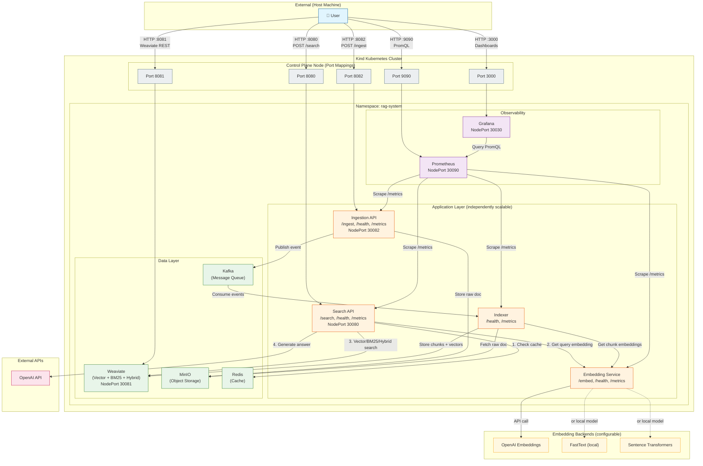

## Connection Summary

### Search Request Flow (Search API)
1. **User → Search API** (`:8080/search`) - HTTP POST with query
2. **Search API → Redis** - Check if response is cached
3. **Search API → Embedding Service** - Get embedding for query
4. **Search API → Weaviate** - Vector/BM25/Hybrid search
5. **Search API → OpenAI** - Generate answer from context
6. **Search API → Redis** - Cache the response
7. **Search API → User** - Return answer + sources

### Document Ingestion Flow (Ingestion API + Indexer)
1. **User → Ingestion API** (`:8082/ingest`) - Upload document
2. **Ingestion API → MinIO** - Store raw document
3. **Ingestion API → Kafka** - Publish `document-changes` event
4. **Kafka → Indexer** - Consumer receives event
5. **Indexer → MinIO** - Fetch raw document
6. **Indexer → Embedding Service** - Get embeddings for chunks
7. **Indexer → Weaviate** - Store chunks with vectors

### Observability Flow
1. **Prometheus → All Services** - Scrape `/metrics` every 15s
2. **Grafana → Prometheus** - Query metrics via PromQL
3. **User → Grafana** (`:3000`) - View dashboards

### Port Mappings (Host → Container)
| Host Port | Container Port | Service |
|-----------|----------------|---------|
| 8080 | 30080 | Search API |
| 8082 | 30082 | Ingestion API |
| 8081 | 30081 | Weaviate |
| 3000 | 30030 | Grafana |
| 9090 | 30090 | Prometheus |

## Independent Scaling

The four application components can be scaled independently:

```bash
# Scale search for high query load
kubectl scale deployment search-api --replicas=5 -n rag-system

# Scale ingestion API for bulk uploads
kubectl scale deployment ingestion-api --replicas=3 -n rag-system

# Scale embedding service for high throughput
kubectl scale deployment embedding-service --replicas=4 -n rag-system

# Scale indexers for faster document processing
kubectl scale deployment indexer --replicas=10 -n rag-system
```

Each service has its own Docker image:

| Service | Image | Dockerfile |
|---------|-------|------------|
| Search API | `localhost:5000/search-api:latest` | `Dockerfile.search-api` |
| Ingestion API | `localhost:5000/ingestion-api:latest` | `Dockerfile.ingestion-api` |
| Embedding Service | `localhost:5000/embedding-service:latest` | `Dockerfile.embedding-service` |
| Indexer | `localhost:5000/indexer:latest` | `Dockerfile.indexer` |

## Weaviate Search Modes

Weaviate supports all three search modes in a single instance (no need for separate deployments):

| Mode | Method | Use Case |
|------|--------|----------|
| **Vector** | HNSW nearest neighbor | Semantic similarity |
| **BM25** | Inverted index | Keyword matching |
| **Hybrid** | Vector + BM25 fusion | Best of both |

```python
# Configure per query
results = weaviate.query(query, mode="hybrid", alpha=0.5)  # 50% vector, 50% BM25
```

## Embedding Service Backends

The Embedding Service abstracts the embedding provider:

| Backend | Config | Use Case |
|---------|--------|----------|
| OpenAI | `EMBEDDING_BACKEND=openai` | Production, high quality |
| FastText | `EMBEDDING_BACKEND=fasttext` | Local, no API costs |
| Sentence Transformers | `EMBEDDING_BACKEND=sentence-transformers` | Local, good quality |

Switch backends via environment variable without code changes.
