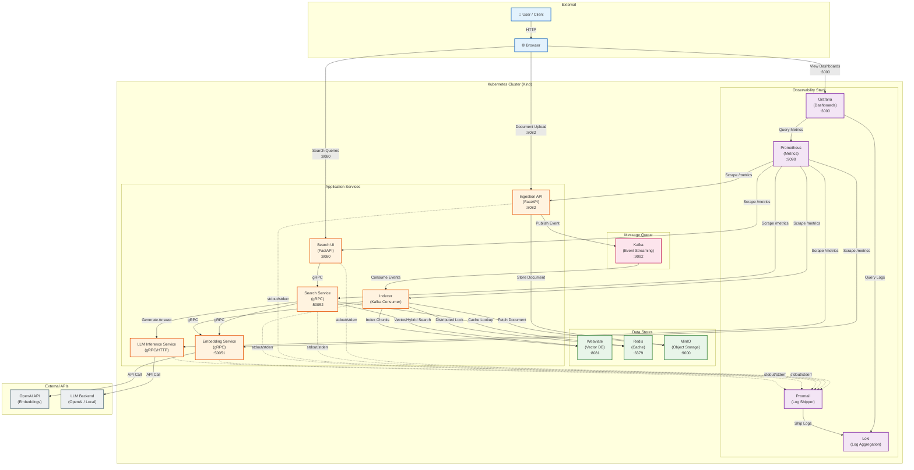

# X-RAG Infrastructure Overview

This diagram provides a high-level view of the X-RAG system architecture, showing all services and infrastructure components running within a Kubernetes cluster.



## Component Overview

### Application Services

| Service | Protocol | Port | Description |
|---------|----------|------|-------------|
| **Search UI** | HTTP/REST | 8080 | User-facing web interface for search |
| **Search Service** | gRPC | 50052 | Backend search logic with RAG pipeline |
| **Ingestion API** | HTTP/REST | 8082 | Document upload endpoint |
| **Indexer** | - | - | Kafka consumer for document processing |
| **Embedding Service** | gRPC | 50051 | Text embedding generation |
| **LLM Inference Service** | gRPC/HTTP | - | Answer generation from context |

### Data Stores

| Component | Port | Purpose |
|-----------|------|---------|
| **Weaviate** | 8081 | Vector database with hybrid search (HNSW + BM25) |
| **Redis** | 6379 | Response caching and distributed locking |
| **MinIO** | 9000 | Object storage for raw documents |

### Message Queue

| Component | Port | Purpose |
|-----------|------|---------|
| **Kafka** | 9092 | Event streaming for async document processing |

### Observability Stack

| Component | Port | Purpose |
|-----------|------|---------|
| **Prometheus** | 9090 | Metrics collection and alerting |
| **Grafana** | 3000 | Dashboards for metrics and logs |
| **Loki** | - | Log aggregation and querying |
| **Promtail** | - | Log shipping agent (DaemonSet) |

## Data Flows

### Search Request Flow

```
User → Search UI → Search Service → Embedding Service → Weaviate → LLM Service → User
                         ↓
                       Redis (cache)
```

1. User submits query via Search UI
2. Search UI forwards to Search Service (gRPC)
3. Search Service checks Redis cache
4. Search Service calls Embedding Service for query embedding
5. Search Service queries Weaviate (vector/hybrid search)
6. Search Service calls LLM Service to generate answer
7. Response cached in Redis and returned to user

### Document Ingestion Flow

```
User → Ingestion API → MinIO → Kafka → Indexer → Embedding Service → Weaviate
```

1. User uploads document via Ingestion API
2. Raw document stored in MinIO
3. Event published to Kafka topic
4. Indexer consumes event, fetches document from MinIO
5. Document chunked and embeddings generated
6. Chunks with vectors stored in Weaviate

### Observability Flow

```
Services → Prometheus (metrics scrape)
Services → Promtail → Loki (log shipping)
Grafana → Prometheus + Loki (visualization)
```

## Implementation Status

| Component | Status | Notes |
|-----------|--------|-------|
| Search UI | ✅ Implemented | FastAPI + Jinja2 templates |
| Search Service | ✅ Implemented | gRPC server with Haystack pipeline |
| Ingestion API | ✅ Implemented | FastAPI with async Kafka producer |
| Indexer | ✅ Implemented | Kafka consumer with distributed locking |
| Embedding Service | ✅ Implemented | gRPC server, OpenAI/hash-based backends |
| LLM Inference Service | ⚠️ Integrated | Currently uses OpenAI API directly |
| Weaviate | ✅ Deployed | Vector + BM25 hybrid search |
| Redis | ✅ Deployed | Caching + distributed locks |
| MinIO | ✅ Deployed | Document object storage |
| Kafka | ✅ Deployed | KRaft mode, single broker |
| Prometheus | ✅ Deployed | Scraping all services |
| Grafana | ✅ Deployed | Basic dashboards |
| Loki | 📋 Planned | Log aggregation |
| Promtail | 📋 Planned | Log shipping |

## Port Summary

| Port | Service | Access |
|------|---------|--------|
| 8080 | Search UI | External (NodePort 30080) |
| 8081 | Weaviate | External (NodePort 30081) |
| 8082 | Ingestion API | External (NodePort 30082) |
| 3000 | Grafana | External (NodePort 30030) |
| 9090 | Prometheus | External (NodePort 30090) |
| 50051 | Embedding Service | Internal (ClusterIP) |
| 50052 | Search Service | Internal (ClusterIP) |
| 6379 | Redis | Internal (ClusterIP) |
| 9092 | Kafka | Internal (ClusterIP) |
| 9000 | MinIO | Internal (ClusterIP) |
