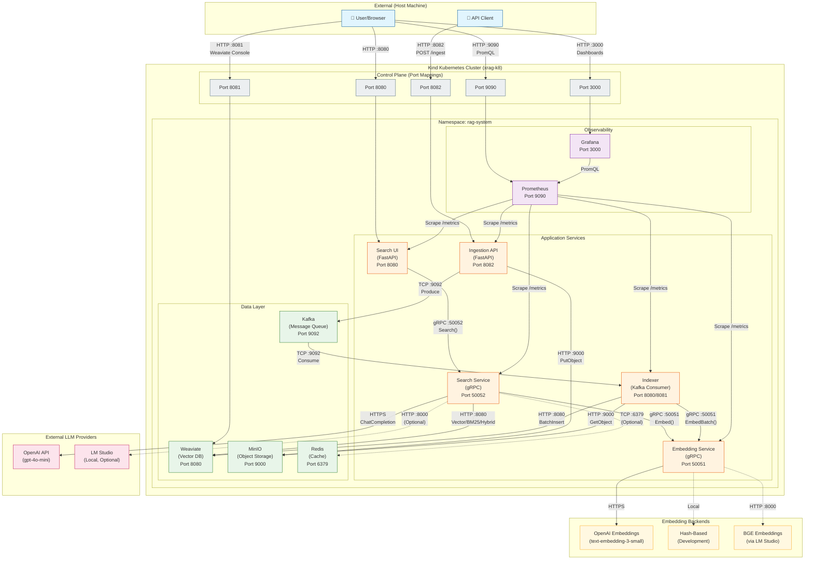
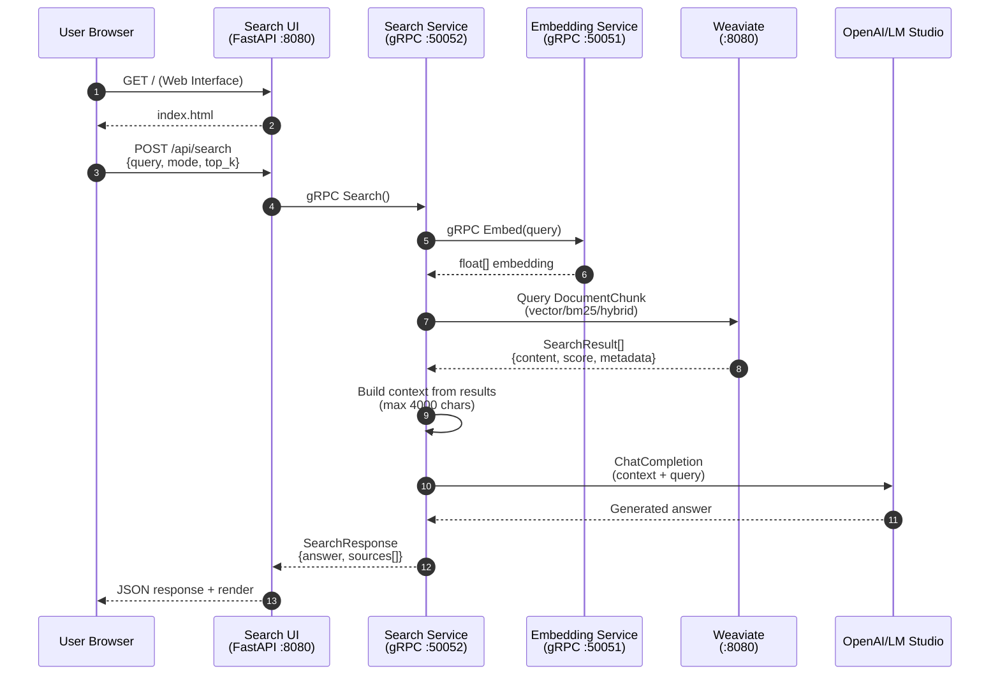
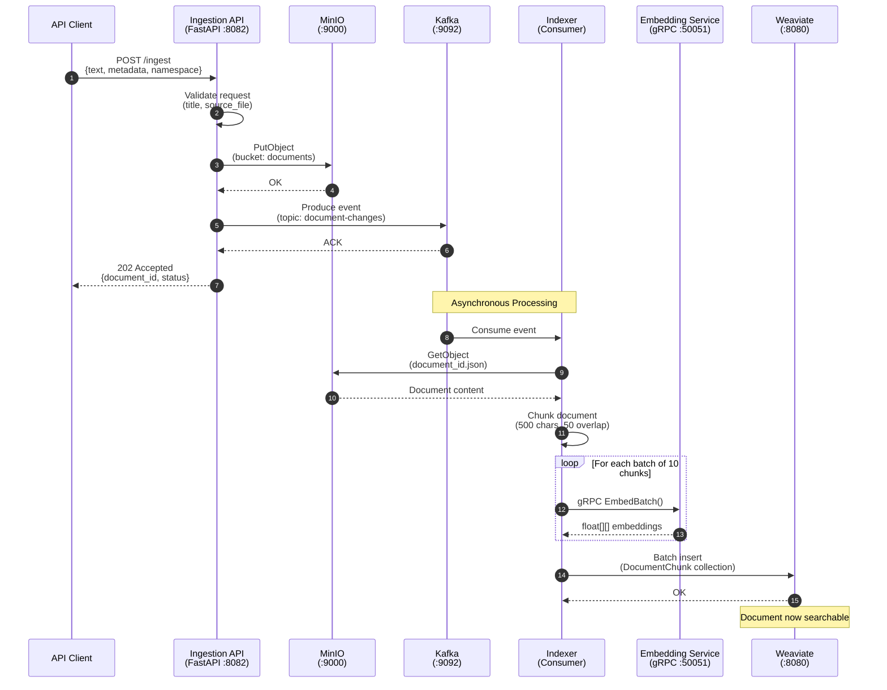
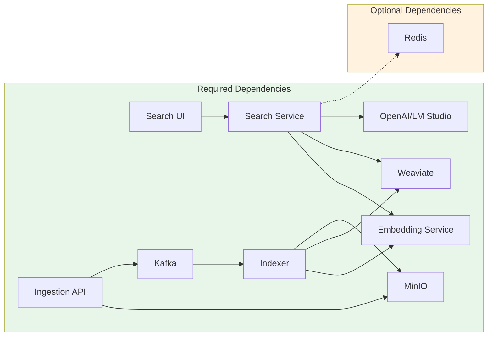

# X-RAG System Architecture Diagram

**Generated:** 2025-12-04
**Based on:** Actual codebase analysis

---

## System Overview



---

## Search Flow (Synchronous)



### Search Flow Details

| Step | Component | Action | Configuration |
|------|-----------|--------|---------------|
| 1-2 | Search UI | Serve web interface | Templates in `src/search_ui/templates/` |
| 3 | Search UI | Forward search request | gRPC client to `search-service:50052` |
| 4-5 | Search Service | Generate query embedding | Via Embedding Service gRPC |
| 6-7 | Search Service | Retrieve documents | Weaviate collection: `DocumentChunk` |
| 8 | Search Service | Build RAG context | Max 4000 characters |
| 9-10 | Search Service | Generate answer | Model: `gpt-4o-mini` (configurable) |
| 11-12 | Search UI | Return results | JSON with answer + sources |

### Search Modes

| Mode | Algorithm | Use Case |
|------|-----------|----------|
| `vector` | Cosine similarity on embeddings | Semantic similarity search |
| `bm25` | BM25F keyword matching | Exact keyword matching |
| `hybrid` | Combined (alpha=0.5) | Best of both (default) |

---

## Ingestion Flow (Asynchronous)



### Ingestion Flow Details

| Step | Component | Action | Configuration |
|------|-----------|--------|---------------|
| 1 | Client | Upload document | `POST /ingest` with JSON body |
| 2 | Ingestion API | Validate metadata | title (1-512 chars), source_file |
| 3-4 | Ingestion API | Store raw document | MinIO bucket: `documents` |
| 5-6 | Ingestion API | Publish event | Kafka topic: `document-changes` |
| 7 | Ingestion API | Return immediately | 202 Accepted (async processing) |
| 8-10 | Indexer | Retrieve document | From MinIO via document_id |
| 11 | Indexer | Chunk document | 500 chars, 50 char overlap |
| 12-13 | Indexer | Generate embeddings | Batches of 10 chunks |
| 14-15 | Indexer | Store in Weaviate | DocumentChunk collection |

---

## Port Mappings

### External Access (Host → Cluster)

| Host Port | NodePort | Service | Protocol | Description |
|-----------|----------|---------|----------|-------------|
| 8080 | 30080 | Search UI | HTTP | Web interface for search |
| 8082 | 30082 | Ingestion API | HTTP | Document upload endpoint |
| 8081 | 30081 | Weaviate | HTTP | Vector database console |
| 3000 | 30030 | Grafana | HTTP | Monitoring dashboards |
| 9090 | 30090 | Prometheus | HTTP | Metrics query interface |

### Internal Services (ClusterIP)

| Service | Port | Protocol | Purpose |
|---------|------|----------|---------|
| Search Service | 50052 | gRPC | Search RPC endpoint |
| Embedding Service | 50051 | gRPC | Embedding generation |
| Weaviate | 8080 | HTTP | Vector DB API |
| Kafka | 9092 | TCP | Message queue |
| MinIO | 9000 | HTTP | Object storage API |
| Redis | 6379 | TCP | Cache (optional) |

### Metrics Endpoints

| Service | Metrics Port | Path |
|---------|--------------|------|
| Search UI | 9091 | `/metrics` |
| Search Service | 8080 | `/metrics` |
| Embedding Service | 8080 | `/metrics` |
| Ingestion API | 8080 | `/metrics` |
| Indexer | 8081 | `/metrics` |

---

## Service Dependencies



### Dependency Matrix

| Service | Hard Dependencies | Soft Dependencies |
|---------|-------------------|-------------------|
| Search UI | Search Service | - |
| Search Service | Embedding Service, Weaviate, OpenAI | Redis (cache) |
| Embedding Service | Configured backend (no fallback - fails on misconfiguration) | - |
| Ingestion API | MinIO, Kafka | - |
| Indexer | Kafka, MinIO, Embedding Service, Weaviate | - |

---

## Health Check Architecture

### HTTP Services

| Service | Liveness | Readiness | Full Health |
|---------|----------|-----------|-------------|
| Search UI | `GET /health/live` | `GET /health/ready` | `GET /health` |
| Ingestion API | `GET /health/live` | `GET /health/ready` | `GET /health` |
| Indexer | `GET /health/live` | `GET /health/ready` | - |

### gRPC Services

| Service | Health Check |
|---------|--------------|
| Search Service | `grpc.health.v1.Health/Check` |
| Embedding Service | `grpc.health.v1.Health/Check` |

### Health Status Values

| Status | Code | Meaning |
|--------|------|---------|
| HEALTHY | 1 | All dependencies operational |
| DEGRADED | 2 | Some non-critical dependencies down |
| UNHEALTHY | 3 | Critical dependencies unavailable |

---

## Embedding Backends

The Embedding Service supports multiple backends. **No automatic fallback** - misconfiguration results in an error at startup.

| Backend | Config Value | Use Case | Dimension |
|---------|--------------|----------|-----------|
| OpenAI | `openai` | Production | 1536 |
| Hash-Based | `hash_based` | Development/Testing (deterministic, no API) | 384 |
| LM Studio (BGE) | `lm_studio` | Local/Privacy | 1024 |

Configuration via environment variable:
```bash
EMBEDDING_GENERATOR_TYPE=openai  # or hash_based, lm_studio
```

**Important:** An invalid or missing `EMBEDDING_GENERATOR_TYPE` will cause the service to fail immediately with a clear error message. This is intentional - silent fallbacks hide configuration problems.

---

## LLM Providers

The Search Service supports multiple LLM providers:

| Provider | Config | Model | Endpoint |
|----------|--------|-------|----------|
| OpenAI | `LLM_PROVIDER=openai` | gpt-4o-mini | api.openai.com |
| LM Studio | `LLM_PROVIDER=lm_studio` | (local model) | localhost:8000 |

---

## Weaviate Schema

### DocumentChunk Collection

```json
{
  "class": "DocumentChunk",
  "properties": [
    {"name": "content", "dataType": ["text"]},
    {"name": "doc_id", "dataType": ["text"]},
    {"name": "chunk_index", "dataType": ["int"]},
    {"name": "namespace", "dataType": ["text"]},
    {"name": "title", "dataType": ["text"]},
    {"name": "source_file", "dataType": ["text"]}
  ],
  "vectorizer": "none",
  "vectorIndexConfig": {
    "distance": "cosine"
  }
}
```

---

## Scaling Configuration

| Service | Default Replicas | Scalable | Notes |
|---------|------------------|----------|-------|
| Search UI | 1 | Yes | Stateless |
| Search Service | 2 | Yes | Stateless |
| Embedding Service | 2 | Yes | Stateless |
| Ingestion API | 2 | Yes | Stateless |
| Indexer | 1 | Limited | Single consumer for ordering |
| Weaviate | 1 | Yes* | StatefulSet |
| Kafka | 1 | Yes* | StatefulSet |
| Redis | 1 | Yes* | StatefulSet |
| MinIO | 1 | Yes* | StatefulSet |

*Infrastructure scaling requires additional configuration.

---

## Quick Commands

```bash
# Check cluster status
make cluster-status

# View service logs
make logs-search-ui
make logs-search-service
make logs-embedding
make logs-ingestion
make logs-indexer

# Access UIs
make open-search-ui        # http://localhost:8080
make open-ingestion-api    # http://localhost:8082/docs
make open-grafana          # http://localhost:3000
make open-weaviate         # http://localhost:8081

# Scale services
kubectl scale deployment search-service --replicas=5 -n rag-system
kubectl scale deployment embedding-service --replicas=4 -n rag-system
```
